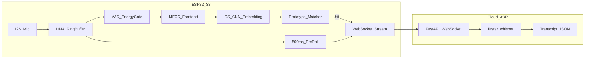

# System Architecture

## Overview

Hybrid edge-cloud pipeline: ESP32-S3 performs always-on keyword spotting locally; upon detection, PCM audio (with 500 ms pre-roll) streams to a cloud faster-whisper ASR server.

## Resource Budget

| Component | Budget |
|-----------|--------|
| TFLite model (INT8) | ≤60 KB flash |
| Tensor arena | ~80 KB SRAM |
| Audio ring buffer | 32 KB |
| Pre-roll buffer | 16 KB |
| **Total peak SRAM** | **≤256 KB** |

## Enrollment Flow

1. User triggers enrollment mode (serial command `enroll`)
2. Device captures 10 × 1 s utterances of custom wake word
3. MFCC → DS-CNN → mean 64-dim embedding stored in NVS
4. Inference compares cosine similarity with 2-of-3 debounce

## Streaming Protocol

- Persistent WebSocket: `ws://host:8765/v1/stream`
- Binary PCM: 16 kHz, mono, int16 LE, 250 ms chunks
- Control byte `0xFF` marks end of utterance
