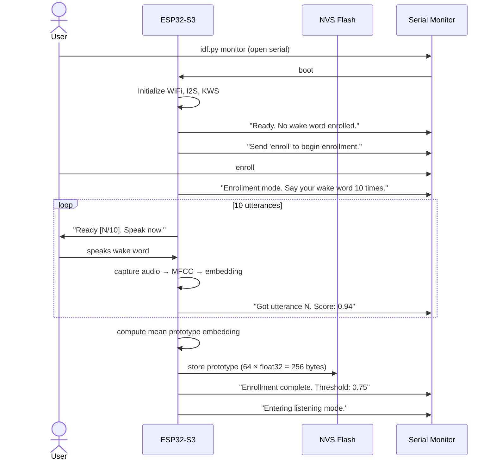
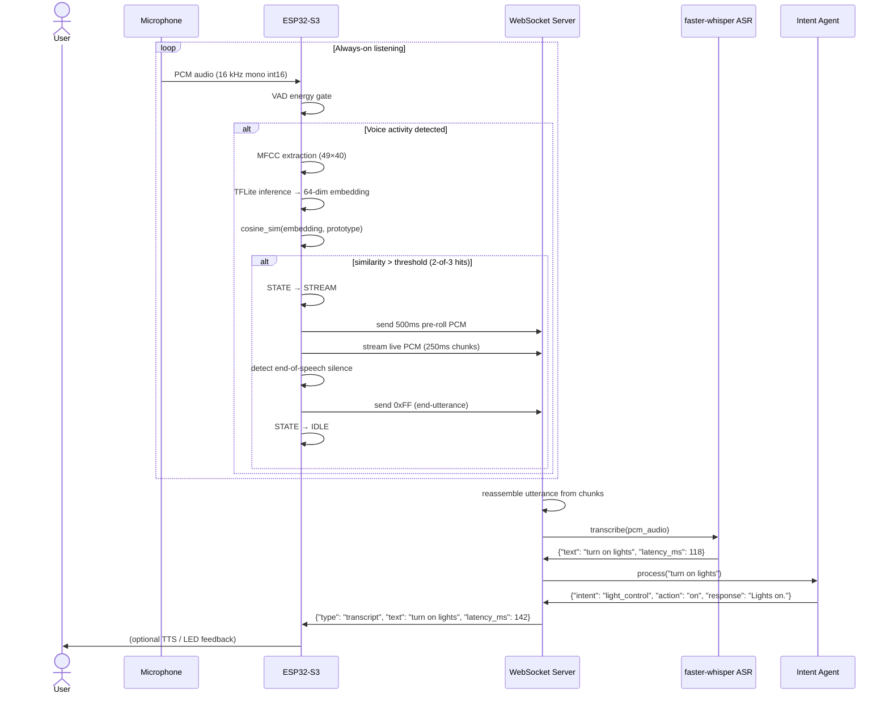
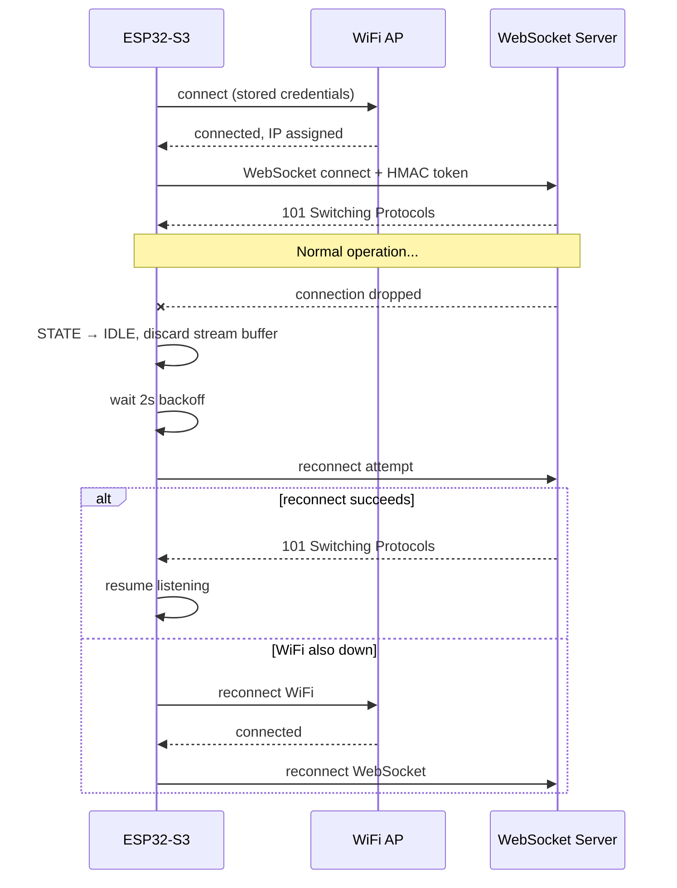

# User Flow

Sequence diagrams and state descriptions for the three primary user interactions.

---

## Flow 1 — Initial Setup & Enrollment



---

## Flow 2 — Normal Wake-Word Detection → ASR



---

## Flow 3 — Error Recovery



---

## Device State Machine

```text
                        ┌──────────┐
            boot        │          │
          ──────────►   │   IDLE   │ ◄─────────────────┐
                        │          │                   │
                        └────┬─────┘                   │
                             │                         │
                    2-of-3 cosine hits                 │
                             │                         │
                        ┌────▼─────┐                   │
                        │          │                   │
                        │   WAKE   │                   │
                        │          │                   │
                        └────┬─────┘                   │
                             │                         │
                    WS connected                       │
                             │                         │
                        ┌────▼─────┐                   │
                        │          │    silence / 0xFF │
                        │  STREAM  │───────────────────┘
                        │          │
                        └────┬─────┘
                             │
                    "enroll" serial command
                             │
                        ┌────▼─────┐
                        │          │
                        │  ENROLL  │
                        │          │
                        └──────────┘
```
